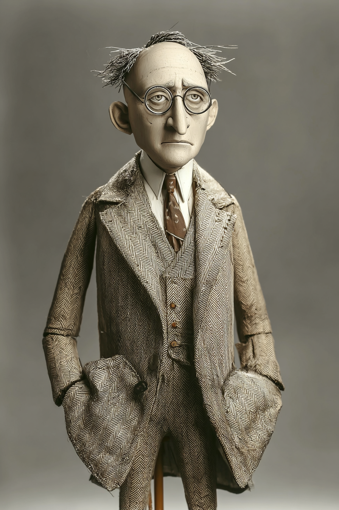

# Claude Code for Teachers — Wayback Sections

> Extracted from `chapters/`. Each entry corresponds to one chapter file.
> Sections are instructor-authored. Missing sections show a placeholder only.
> Do not edit this file directly — edit the source chapter file, then re-run extraction.

---

## Chapter 00: Claude Code for Teachers
*Source: `chapters/00-frontmatter.md`*

> **Section not yet authored.** No `## AI Wayback Machine` block found in this chapter file.
> To add this section, edit the source chapter file directly.

---

## Chapter 00: Introduction
*Source: `chapters/00-introduction.md`*

> **Section not yet authored.** No `## AI Wayback Machine` block found in this chapter file.
> To add this section, edit the source chapter file directly.

---

## Chapter 01: Chapter 0 — Introduction: The Line
*Source: `chapters/01-introduction-the-line.md`*

##  AI Wayback Machine
 **John Dewey** (1859–1952) — American philosopher of education whose *Experience and Education* (1938) argued that **learning is the transformation of the learner through purposeful experience**, not the deposit of information into the learner.[^1] Dewey's most consequential contribution to teacher education was the concept of *reflective practice* — the teacher who learns by teaching, who deepens their own understanding through the act of making the discipline explicit for students, who treats the classroom as a site of inquiry for both parties.

*Puppet Art by [Nik Bear Brown](https://www.nikbearbrown.com/).*

The interleaved structure of this book — teacher build and classroom activity in every chapter — is Dewey applied to AI-assisted classroom builds. The teacher who builds a grading tool with the framework and immediately designs a classroom activity using the same concept is doing reflective practice in real time. The cognitive structures that constitute the teacher's understanding of conducting (Shulman's pedagogical content knowledge) are built through the *engagement* with both halves, not through the reading-about-engagement Dewey warned was insufficient.

Dewey wrote in 1938 about teachers and laboratories. He could not have imagined Claude Code. The principle scales without translation. The teacher who builds is the teacher who can teach building. The teacher who has only read about building can describe the framework but cannot, when a student is stuck mid-build at 2:14 PM on a Tuesday, name what the framework would say to do — because the framework's specifics live in practice, not in description.

The book's premise is Dewey's premise: experience is the mechanism. The chapters that follow are the structured experience.

---

---

## Chapter 02: Chapter 1 — Your First Terminal Session: Claude Code Is Not ChatGPT
*Source: `chapters/02-first-terminal-session.md`*

##  AI Wayback Machine
 **Alan Kay** (born 1940) — American computer scientist whose 1972 Xerox PARC paper *"A Personal Computer for Children of All Ages"* introduced the concept of the **Dynabook** — a personal computer designed not as a faster typewriter but as a *medium for exploration*, a tool through which the user could *think about thinking*.[^1] Kay's argument, refined across forty years of work at Xerox PARC, Apple, and HP, was that the computer's deepest contribution would not be efficiency at predefined tasks but the *expansion of the human ability to formulate questions worth asking*.

The questions-before-code rule in this chapter is Kay applied to terminal AI. The first session is not the most efficient path to executing a build; it is the path that develops the teacher's *capacity to formulate the specifications* that the build requires. Claude Code is a Dynabook in Kay's sense — a medium through which the teacher learns what the project actually is by asking it questions, not by typing instructions to it. The five-question calibration is the medium being used as Kay intended it.

Kay's most quoted line — *"The best way to predict the future is to invent it"* — describes the agentic loop in a way Kay himself could not have foreseen. The teacher who runs `/init`, asks five questions, edits a plan in plan mode, and executes a small change has invented a small piece of their own classroom future. The next chapter (`CLAUDE.md`) is the artifact that captures the inventions and makes them durable across sessions.

---

---

## Chapter 03: Chapter 2 — CLAUDE.md: Your Coding Constitution
*Source: `chapters/03-claude-md.md`*

##  AI Wayback Machine
 **Donald Knuth** (born 1938) — American computer scientist whose 1984 *Computer Journal* paper *"Literate Programming"* introduced the radical idea that **a program is a document written for a human reader, with the executable code as a byproduct of the explanation**.[^1] Knuth's argument was that the conventional separation between code (for the machine) and documentation (for the human, written afterward, often not at all) was backwards. The right form was integrated: the program's explanation and its executable form, woven together, with the explanation primary.

CLAUDE.md is literate programming inverted for the AI era. Where Knuth's literate programs explained the code to the human reader, the CLAUDE.md explains the project's conventions to the AI reader — and to the human reader who comes next. The two readers receive the same text. The conventions that matter to Claude (the never-rules, the environment quirks, the architectural decisions) are exactly the conventions that matter to the next teacher who picks up the project. The artifact serves both audiences without translation.

Knuth's deeper insight was about *what counts as the program*. In the conventional view, the program is the executable; the documentation is meta. In the literate view, the program is the *understanding* of what is being built; the executable is an artifact derived from the understanding. The CLAUDE.md works the same way. The project's discipline lives in CLAUDE.md; the actual files in `src/` are derived from the discipline. Two collaborators (you and Claude, or you and another teacher) can converge on consistent outputs because the discipline is the same shared text. Forty years after Knuth, the principle scales without modification.

---

---

## Chapter 04: Chapter 3 — From Prompts to Specifications: The First Build
*Source: `chapters/04-prompts-to-specifications.md`*

##  AI Wayback Machine
 **George Pólya** (1887–1985) — Hungarian-American mathematician whose *How to Solve It* (1945) formalized problem-solving as a four-stage sequence: **understand the problem, devise a plan, carry out the plan, look back**.[^1] Pólya's argument was that mathematical (and by extension, all technical) problem-solving was not the spontaneous insight popular culture imagined it to be — it was a *teachable discipline* with predictable stages. The teacher's job, Pólya argued, was to *make the stages explicit* so that the student could exercise each one deliberately rather than skip to the answer.

The Explore → Plan → Implement → Commit workflow is Pólya's sequence applied to Claude Code. *Explore* is Pólya's *understand*: the teacher and Claude together read the project, identify the constraint, surface the assumption. *Plan* is Pólya's *devise*: the specification is composed, plan mode renders it, the teacher edits via Ctrl+G. *Implement* is Pólya's *carry out*: Claude executes; the agentic loop runs. *Commit* is Pólya's *look back*: the descriptive commit message captures what was decided and why, available to future-you when the project is revisited.

The five-element specification is the artifact form of Pólya's *plan* stage. The element-by-element discipline forces explicit decision at exactly the points where the request-form prompt allows the decision to default. Pólya's deeper claim — that the discipline of explicit-stages produces durable problem-solving capacity, not just one solved problem — is the chapter's claim about specifications: the practice of writing them makes the teacher better at *thinking* about builds, not just at producing them.

Pólya wrote eighty years before Claude Code. The framework holds without modification. The agentic loop is faster than any other mechanism for executing the carry-out stage; the slowness, when it appears, is always in the stages Pólya warned were the most important — understand and devise.

---

*Puppet Art by [Nik Bear Brown](https://www.nikbearbrown.com/).*

---

## Chapter 05: Chapter 4 — Handoff Conditions: The Gate Between Steps
*Source: `chapters/05-handoff-conditions.md`*

##  AI Wayback Machine
 **W. Edwards Deming** (1900–1993) — American statistician whose **Plan-Do-Check-Act** cycle, articulated across *Out of the Crisis* (1986) and his decades of work with Japanese manufacturers, made the case that **quality is built into a process through explicit verification at every step, not inspected in at the end**.[^1] Deming's argument, against the dominant practice of his era, was that final inspection was the most expensive place to catch failure. The cheapest place to catch failure was at every handoff in the production sequence — the place where the work crossed from one stage to the next.

*Puppet Art by [Nik Bear Brown](https://www.nikbearbrown.com/).*

The handoff condition is PDCA at command granularity. Plan: the specification (Chapter 3). Do: the Explore → Plan → Implement → Commit workflow. Check: the handoff condition. Act: `/rewind` and respecify (or proceed) based on what the check revealed. The four phases map directly. Deming wrote about manufacturing lines; the conducting discipline is the same shape at terminal scale.

Deming's most quoted line — *"A bad system will beat a good person every time"* — is the argument for Chapter 7's Hooks foreshadowed here. The system is what enforces the discipline when the practitioner is tired, distracted, or under deadline pressure. The handoff condition is the discipline; the hook is the system that makes the discipline non-optional. Both come from Deming's insistence that quality is *built in*, not heroically enforced by individuals.

Deming's Toyota collaborators extended the principle with the **andon-cord** — the right of any worker on the line to stop production at any abnormality, without permission, without consequence. The teacher who runs `/rewind` on a failed handoff is pulling the andon-cord. The cost of stopping the build at the failed step is one of the cheapest costs in the system. Deming's framework formalizes why.

---

---

## Chapter 06: Chapter 5 — The Five Supervisory Capacities
*Source: `chapters/06-five-supervisory-capacities.md`*

##  AI Wayback Machine
 **Norbert Wiener** (1894–1964) — American mathematician and founder of cybernetics, whose *The Human Use of Human Beings* (1950, rev. 1954) argued that **the question for any human-machine system is not whether the machine works, but whether the human-machine feedback loop maintains its goal**.[^2] Wiener's framing was the loop, not either party. The system's intelligence lives in the corrections the human makes to the machine and the corrections the machine makes possible for the human. Without the corrections, the loop is open and the system drifts.

The five supervisory capacities are Wiener's feedback loop made specific to Claude Code. PA catches the drift in Claude's output. PF closes the loop upstream by formulating the right problem. TO selects the appropriate feedback channel (CLAUDE.md, Skill, Hook, Subagent) for each step. IJ supplies the context the model cannot infer. EI holds the whole loop toward the original goal across multiple turns. Each capacity is a feedback mechanism. The discipline is the practice of keeping the loop closed when the temptation is to let Claude run open and trust the output.

Wiener's most quoted warning, in the 1954 revision: *"We can be humble and live a good life with the aid of the machines, or we can be arrogant and die."* The chapter's framing is less dramatic. The teacher who exercises the five capacities is humble in Wiener's sense — neither delegating judgment to Claude nor refusing the agentic loop entirely, but *conducting* both. The teacher who delegates the capacities is the open-loop case Wiener warned about. Seventy years later, the warning still holds.

---

---

## Chapter 07: Chapter 6 — Skills: Build Once, Use Every Semester
*Source: `chapters/07-skills.md`*

##  AI Wayback Machine
 **Charles Babbage** (1791–1871) — British mathematician whose designs for the Analytical Engine (1837–1871) included the conceptual foundation for what would later be called the *subroutine*: a stored, named operation that could be invoked at any point in a program's execution without being re-specified each time.[^1] Babbage's argument, articulated in his autobiography *Passages from the Life of a Philosopher* (1864), was that the Engine's power came not from any individual operation but from the *reusability* of operations across many computations. A subroutine specified once and stored on a punched card could be invoked from any program; the work of specification was done once and amortized across every future invocation.

A Claude Code Skill is a Babbage subroutine in 2026 form. The teacher writes the grading workflow once. The workflow is stored as `SKILL.md`. The invocation is `/grading-workflow`. The cost of specification is amortized across every grading cycle for as long as the project lives. Babbage's insight — that the unit of programming work is the *named reusable procedure*, not the per-execution command — is the chapter's insight applied to teacher practice.

Babbage built the conceptual machine; Ada Lovelace, his collaborator, wrote the first program for it (the Bernoulli-number computation in Note G of her 1843 translation of Menabrea's article) and articulated the principle that the Analytical Engine could perform any operation whose specification could be encoded.[^2] Lovelace's deeper argument — that the value of the machine depended on the *programmer's craft* of designing the operations — is the deeper argument of this chapter. The Skill is only as good as the workflow specified in it. The conducting discipline produces good Skills. Bad workflows produce Skills that have to be re-specified after every invocation, which is no better than per-session prompting.

Babbage and Lovelace did not see their machine built. The conceptual framework outlived the physical constraint. Two centuries later, the Skill is the operational form of their argument. The teacher who maintains a Skill catalog across a school year is the practitioner Lovelace imagined.

---

---

## Chapter 08: Chapter 7 — Hooks: The Enforcement Layer
*Source: `chapters/08-hooks.md`*

##  AI Wayback Machine
 **Claude Shannon** (1916–2001) — American mathematician and electrical engineer whose 1937 MIT master's thesis *"A Symbolic Analysis of Relay and Switching Circuits"* established that **boolean logic could be implemented as physical mechanisms — relays, transistors, eventually integrated circuits — that enforce boolean conditions regardless of context, regardless of intent, regardless of who is using the system**.[^1] Shannon's later work in *"A Mathematical Theory of Communication"* (1948) founded information theory; the 1937 thesis was the operational foundation that made digital computing possible.

A Hook is a Shannon gate for Claude Code. The CLAUDE.md instruction is the *advisory* — what Claude is told to do, processed through Claude's probabilistic decision-making. The Hook is the *gate* — a physical mechanism (a script, an HTTP endpoint, a process) that enforces the boolean condition regardless of what Claude decides. The PreToolUse hook on Write does not negotiate with Claude. It runs. It returns. The condition holds.

Shannon's deeper insight was that the reliability of digital systems came from this separation: high-level decisions could be probabilistic, fast, flexible — and inviolable constraints could be enforced by the physical layer underneath. The two together produced systems more capable and more reliable than either alone. The hook architecture in Claude Code is the same pattern at the agent layer. Claude's probabilistic flexibility is what makes it useful; the hook layer's mechanical enforcement is what makes it safe. The two layers compose.

Shannon would recognize the hook configuration in `.claude/settings.json`. It is a boolean network of conditions, evaluated mechanically, enforced regardless of context. Eighty years after the master's thesis, the pattern scales without modification.

---

---

## Chapter 09: Chapter 8 — The Dangerous Middle: When Claude Is Right and Wrong Simultaneously
*Source: `chapters/09-dangerous-middle.md`*

##  AI Wayback Machine
 **Alfred Binet** (1857–1911) — French psychologist who developed the first intelligence test (1905, with Théodore Simon) and who, almost immediately upon its publication, warned against using it as a *fixed measure* of a child's capacity.[^10] Binet's insistence — articulated in *Les idées modernes sur les enfants* (1909) — was that the test was an *instrument*, not a verdict. The instrument produced a number. The number required *human interpretation* to become a judgment. The interpretation was the teacher's, informed by the score; the score was not the judgment.

The dangerous middle in AI-assisted grading is Binet's warning applied to LLM rubric assessment. The model produces flag reports that are technically correct against the rubric and that, applied without the human interpretation layer, will systematically disadvantage students whose linguistic backgrounds fall outside the rubric's implicit assumptions. The narrowing principle is the structural form of preserving Binet's interpretation layer. The teacher reads the flags. The teacher writes the feedback. The student gets language that was authored by someone who knows them and not by a system that processed their writing as a sequence of tokens.

Binet's warning was not heeded historically. Within a decade of his death, IQ testing was being used in the United States as a fixed-measure tool for educational sorting — exactly what Binet had warned against. The structural lesson is not that instruments are bad. The structural lesson is that *instruments without preserved interpretation layers get used in ways their inventors warned about* — particularly in ways that disadvantage minoritized populations. The chapter's discipline is the preservation of the interpretation layer against the institutional pressure to skip it.

The chapter could equally have used **Asa G. Hilliard III** (1933–2007), whose work on cultural bias in standardized testing — particularly for African American students — directly anticipated the AAVE-bias findings the chapter cites. Hilliard's *Testing African American Students* (1991) made the empirical case that the *form* of measurement systematically disadvantages students whose linguistic and cultural backgrounds the measurement does not register as valid. The chapter's choice between Binet and Hilliard is a question of emphasis: Binet for the general warning about interpretation layers; Hilliard for the specific case about AAVE and minoritized populations. Both apply.

---

---

## Chapter 10: Chapter 9 — Subagents: Keeping the Build Clean
*Source: `chapters/10-subagents.md`*

##  AI Wayback Machine
 **Herbert Simon** (1916–2001) — American polymath, Nobel laureate in economics, Turing Award winner, founding figure of artificial intelligence and cognitive science, whose 1962 paper *"The Architecture of Complexity"* formalized the principle of **nearly decomposable systems**: that large complex systems are best understood and operated upon as *clusters of subsystems* that are tightly connected internally and loosely connected externally.[^1] Simon's argument was that the cognitive trick that makes complexity tractable is the boundary between the inside and the outside of a subsystem — the inside is detailed; the outside is summary.

A subagent is Simon's nearly decomposable subsystem applied to Claude Code. The pattern-analyzer's inside is detailed: 25 submissions read, parsed, scored, compared. The pattern-analyzer's outside — what the main session sees — is a summary. The summary is the *external interface* of the subsystem; the per-submission work is the *internal detail*. The main session operates on the summary; it does not need the detail. Simon's claim was that this boundary is what makes complex systems thinkable; the chapter's claim is that this boundary is what makes complex builds tractable.

Simon's deeper insight was that nearly-decomposable architecture is *not* an arbitrary design choice — it is the architecture that complex systems converge toward because the alternative (every part connected to every other part) does not scale. The subagent in Claude Code is the design choice that makes long sessions possible; the main-session-only design hits a context wall that no amount of skill or hook configuration can solve. Decomposition is the architecture; subagents are the operational form.

The chapter recommends single subagents for student-scale work; Simon's framework anticipates the agent-team future where multiple subagents are coordinated by a main agent, each handling one nearly-decomposable subsystem of a larger build. The principle is the same. The complexity it makes tractable scales with the practitioner.

---

---

## Chapter 11: Bridge — From Tools That Save Time to Tools That Change What's Possible
*Source: `chapters/11-bridge-tools-that-change-whats-possible.md`*

> **Section not yet authored.** No `## AI Wayback Machine` block found in this chapter file.
> To add this section, edit the source chapter file directly.

---

## Chapter 12: Chapter 10 — The Three-File System: Intent, Constitution, State
*Source: `chapters/12-three-file-system.md`*

##  AI Wayback Machine
 **Eileen Gray** (1878–1976) — Irish-French architect and designer whose villa **E-1027** (built 1926–1929 on the French Riviera) is one of the canonical examples of *total design* — a building in which every element from the structural frame to the door handles to the built-in furniture to the wall-mounted maps was specified by the designer as a coherent whole.[^1] Gray's argument, articulated in her writings and embodied in her work, was that **the parts of a designed environment cannot be separated from the whole** — that a house designed by one person and furnished by another is two designs in conflict, regardless of either party's skill.

The three-file system is Gray's total design applied to AI-assisted simulation building. The Technical Constitution is the structural frame: what the simulation is made of. The Visual Constitution is the interior surfaces: what it looks like and how the user interacts. The Intent Layer is the program: what the building is *for*, what experience it is designed to produce. A simulation built with the three files complete is designed as a coherent whole; a simulation built from a one-line prompt is two designs in conflict — yours (implicit) and Claude's (explicit and inconsistent with yours).

Gray's E-1027 was for many decades attributed to her partner Le Corbusier, who lived in the villa, painted murals on its walls without her permission, and whose name eclipsed hers in the historical record. The reattribution to Gray is a story of the same year — 2026 — that this chapter is published in: the slow but increasing recovery of women's authorship in modernist design. The chapter cites Gray here partly because her total-design framework is the precise architectural ancestor of the three-file system, and partly because the cumulative effect of every chapter's Wayback figure matters. Gray belongs in the lineage.

The Brutalist framework that the chapter operationalizes is itself in this lineage — a 2025–2026 design system that asks the practitioner to specify the *whole* before generating any of the *parts*. The discipline is total design. The artifact is the simulation. The author is you.

---

*Puppet Art by [Nik Bear Brown](https://www.nikbearbrown.com/).*

---

## Chapter 13: Chapter 11 — Building the Simulation: Conducting at Full Complexity
*Source: `chapters/13-building-the-simulation.md`*

##  AI Wayback Machine
 **Donald Schön** (1930–1997) — American philosopher and urban planner whose *The Reflective Practitioner* (1983) introduced the concept of **reflection-in-action**: the practitioner's capacity to think about what they are doing *while* they are doing it, adjusting in real time as the work surfaces conditions the upfront plan did not anticipate.[^1] Schön's argument was against the *technical rationality* model — the view that professional work is the mechanical application of pre-formed expertise to standard situations. Real professional work, Schön observed, is continuous interpretation of unique situations: the lawyer with the unusual case, the doctor with the atypical presentation, the architect with the awkward site.

The Generation Log in PROJECT.md Layer 2 is Schön's reflection-in-action made into an artifact. The Generation Log captures the reflection happening in real time during the build — which capacity fired at which moment, what the pivotal moment looked like, how the three-file constitution was updated under build pressure. The build proceeds while the reflection is recorded; the reflection feeds the next decision; the decision generates the next entry. Schön would recognize the structure: the practitioner is not applying rules to a standard simulation; they are interpreting a unique build at each step, with the Generation Log as the accumulated record of those interpretations.

Schön's most-quoted line — *"The practitioner allows himself to experience surprise, puzzlement, or confusion in a situation which he finds uncertain or unique"* — describes the Step 3 moment when `setTimeout` appeared in violation of the spec, or the Step 4 moment when Claude's scope-creep suggestion required a *not now*. The surprise is the data. The reflection is the discipline. The Generation Log is the artifact that converts the moment into capacity for the next build.

Schön wrote about teachers, doctors, planners. The framework holds for the teacher conducting Claude through a classroom simulation. The agentic loop is faster than the human's capacity to design every move in advance; reflection-in-action is the bridge between the loop's autonomy and the build's pedagogical integrity. Forty years after *The Reflective Practitioner*, the framework scales without modification.

---

---

## Chapter 14: Chapter 12 — Deploying in Class: From Build to Lesson
*Source: `chapters/14-deploying-in-class.md`*

##  AI Wayback Machine
 **Maria Montessori** (1870–1952) — Italian physician and educator whose method, articulated in *The Montessori Method* (1912) and elaborated through forty years of practice, was built on a principle she called **control of error** — that educational materials should be *designed so the student can identify and correct their own mistakes without teacher intervention*.[^1] A Montessori knobbed cylinder set has cylinders of graded sizes that fit into matching holes; if the child puts a cylinder in the wrong hole, the last cylinder will not fit. The material announces the error. The child re-does the work. No teacher correction; no shame; the error becomes information.

*Puppet Art by [Nik Bear Brown](https://www.nikbearbrown.com/).*

The classroom-deployment work is Montessori applied to teacher craft. The simulation's graceful-failure messages are the cylinder set's *last-cylinder-doesn't-fit* moment — the simulation announces what is wrong and what to do about it, without the teacher having to mediate. The three-check protocol is the prepared environment from *The Absorbent Mind* — the work the teacher does *before* the students arrive, so that the environment supports the learning rather than obstructs it. Montessori's framing was for the child's environment; the chapter's framing is for the teacher's classroom tool. The principle is the same: design the artifact so the failure mode is informational and recoverable, not catastrophic.

Montessori's most enduring contribution was the recognition that *learning happens in a prepared environment* — and that the preparation is the teacher's most important work. The chapter's three-check protocol is exactly this preparation. The simulation is the prepared environment; the deployment verification is the preparation; the graceful-failure messages are the control of error that lets the simulation serve the lesson rather than disrupt it. A century after *The Montessori Method*, the principle scales to AI-built classroom tools without losing any of its force.

---

---

## Chapter 15: Chapter 13 — Teaching the Discipline: What Your Students Are Reading
*Source: `chapters/15-teaching-the-discipline.md`*

##  AI Wayback Machine
 **Lee Shulman** (born 1938) — American educational psychologist whose 1986 *Educational Researcher* article *"Those Who Understand: Knowledge Growth in Teaching"* introduced the concept of **pedagogical content knowledge (PCK)** — the distinct knowledge a teacher needs that is *neither* pure subject expertise *nor* general pedagogy, but the specific synthesis of *how to teach this particular subject to these particular students*.[^1] Shulman's argument was that good teachers know things that good practitioners of the subject do not necessarily know, and that good general educators also do not know — the subject-specific transformations and representations that make the subject teachable.

The conducting framework is PCK applied to AI-assisted classroom teaching. The teacher who has built a class website, a grading tool, and a simulation with the framework has PCK that neither a CS professor without classroom experience nor a generalist education professor without Claude Code experience can replicate. The CLAUDE.md is the artifact of that PCK. The build transcripts are the artifact of that PCK. The dangerous-middle stories are the artifact of that PCK. None can be downloaded from a textbook because PCK is built only through doing.

Shulman extended PCK in his 1987 *Harvard Educational Review* paper to argue that teaching requires the practitioner to *reconstruct the subject in pedagogically appropriate forms* — analogies, demonstrations, examples, narrative — for the particular students in the particular classroom. The teacher's CLAUDE.md walkthrough, the dangerous-middle story, the build-log rubric are exactly this reconstruction. The conducting framework provides the subject; the teacher's lived practice provides the pedagogically-appropriate forms.

Mishra and Koehler extended Shulman's PCK to *Technological Pedagogical Content Knowledge (TPACK)* in their 2006 *Teachers College Record* paper — adding technology as a third dimension that interacts with subject and pedagogy. The conducting framework is TPACK applied to AI tools specifically. The technology (Claude Code) interacts with the subject (CS, or whatever the simulation teaches) and the pedagogy (how the teacher structures the classroom around the tool). Mishra and Koehler's argument was that teachers who develop TPACK across all three dimensions teach more effectively than teachers who develop one or two. The chapter's recommendation — bring your CLAUDE.md, your transcripts, your dangerous-middle stories into the classroom — is the operational form of TPACK development for the agentic-AI classroom of 2026.

---

---

## Chapter 16: Chapter 14 — Your Terminal Deliverable: The Post-Build Document
*Source: `chapters/16-post-build-document.md`*

##  AI Wayback Machine
 **bell hooks** (1952–2021) — American scholar and educator whose *Teaching to Transgress: Education as the Practice of Freedom* (1994) argued that **the teacher is a practitioner who learns alongside the student**, and that the most important pedagogical artifact a teacher produces is the *record of their own continuous learning*, made visible to the students they teach.[^1] hooks's argument was against the teacher-as-finished-authority model — the teacher who has mastered the subject and now delivers it. She argued for the teacher-as-fellow-practitioner — the teacher who is still learning the subject, who shows the learning openly, who treats the classroom as a site where the teacher's growth and the students' growth are bound together.

The post-build document is hooks applied to AI-assisted teaching. The document is not a record of mastery; it is a record of continued learning. The *what I would do differently* section names what the teacher does *not* yet have mastery of — the decisions they would reverse, the architectures they would rewrite, the orderings they would invert. The honesty is the pedagogical content. A teacher who can show students *what I am still learning, three months into this practice* models the discipline the framework exists to produce — not the appearance of certainty, but the practice of conducting under uncertainty.

hooks wrote that *"as a classroom community, our capacity to generate excitement is deeply affected by our interest in one another, in hearing one another's voices, in recognizing one another's presence."* The chapter's recommendation — share your post-build document's lessons with your colleagues, with your students, with the next teacher to read this book — is hooks's vision applied to the artifact. The document is one voice in a conversation across practitioners; the conversation is the field of practice. Without the documents, each practitioner reinvents the framework alone. With them, the practice compounds across teachers and across years.

The book ends here.

You are now the practitioner.

The next build is yours.

---

[^1]: hooks, b. *Teaching to Transgress: Education as the Practice of Freedom*. Routledge, 1994. The 2017 paperback edition is the standard recent reference. (hooks chose to write her name in lowercase as a deliberate orthographic choice; this convention is preserved here.)

*Puppet Art by [Nik Bear Brown](https://www.nikbearbrown.com/).*

---

## Chapter 97: The Fundamental Themes
*Source: `chapters/97-fundamental-themes.md`*

> **Section not yet authored.** No `## AI Wayback Machine` block found in this chapter file.
> To add this section, edit the source chapter file directly.

---

## Chapter 99: 99 Back Matter
*Source: `chapters/99-back-matter.md`*

> **Section not yet authored.** No `## AI Wayback Machine` block found in this chapter file.
> To add this section, edit the source chapter file directly.

---
